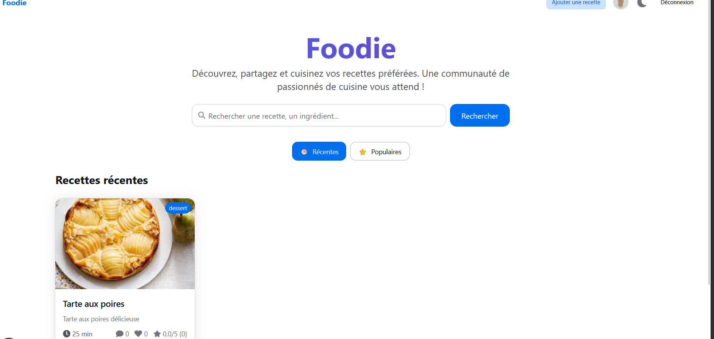
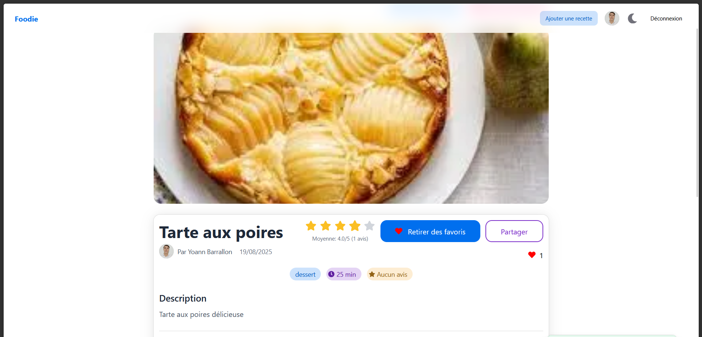

# 🍳 Foodie-Cook

Foodie-Cook is a modern web application for managing and sharing cooking recipes. Create, share, and discover delicious recipes with an elegant and intuitive user interface.

## 📸 Screenshots

<div align="center">

### 🏠 Home Screen



### 📝 Recipe View



</div>

## ✨ Features

- 📝 **Recipe Management** - Create, edit, and delete your recipes
- ⭐ **Favorites System** - Bookmark your favorite recipes
- 💬 **Comments & Ratings** - Rate and comment on recipes
- 👤 **Authentication** - Secure login system with NextAuth.js
- 🔍 **Advanced Search** - Find recipes by ingredients or categories
- 📱 **Responsive Design** - Interface adapted to all devices

## 🛠 Tech Stack

- **Frontend:** Next.js 15, React 18, TypeScript
- **UI/UX:** HeroUI V2, Tailwind CSS, Framer Motion
- **Backend:** Next.js API Routes, Prisma ORM
- **Database:** PostgreSQL
- **Authentication:** NextAuth.js
- **Deployment:** Docker & Docker Compose

## 🚀 Installation & Getting Started

### Prerequisites

- Docker and Docker Compose installed
- Git

### Installation

1. **Clone the repository**

   ```bash
   git clone <your-repo-url>
   cd foodie-cook
   ```

2. **Environment configuration**

   ```bash
   cp env.example .env
   ```

   Edit the variables in `.env` according to your needs.

3. **Start with Docker Compose**

   ```bash
   docker compose up -d
   ```

4. **Initialize the database**

   ```bash
   # Apply migrations
   docker compose exec app npx prisma migrate deploy

   # (Optional) Seed with test data
   docker compose exec app npx prisma db seed
   ```

The application will be accessible at [http://localhost:3000](http://localhost:3000)

## 📊 Project Structure

```
foodie-cook/
├── app/                    # Next.js 15 App Router
│   ├── actions/           # Server Actions
│   ├── recipes/           # Recipe pages
│   └── api/               # API Routes
├── components/            # Reusable components
├── lib/                   # Utilities and configurations
├── prisma/               # Prisma schema and migrations
├── public/               # Static assets
└── styles/               # Global styles
```

## 🐳 Docker Commands

```bash
# Start services
docker compose up -d

# View logs
docker compose logs -f

# Rebuild the application
docker compose up --build app

# Stop services
docker compose down

# Remove volumes (⚠️ deletes data)
docker compose down -v
```

## 🗄 Database

### Prisma Migrations

```bash
# Create a new migration
docker compose exec app npx prisma migrate dev --name <migration_name>

# Apply migrations in production
docker compose exec app npx prisma migrate deploy

# Reset the database
docker compose exec app npx prisma migrate reset
```

### Direct PostgreSQL Access

```bash
# Connect to the database
docker compose exec db psql -U postgres -d foodie_cook
```

## 🔧 Development

For local development without Docker:

1. **Install dependencies**

   ```bash
   pnpm install
   ```

2. **Start PostgreSQL** (with Docker)

   ```bash
   docker compose up db -d
   ```

3. **Configure the database**

   ```bash
   npx prisma migrate dev
   npx prisma generate
   ```

4. **Start the development server**
   ```bash
   pnpm dev
   ```

## 📝 Available Scripts

- `pnpm dev` - Development server with Turbopack
- `pnpm build` - Production build
- `pnpm start` - Production server
- `pnpm lint` - ESLint linter

## 🤝 Contributing

Contributions are welcome! Feel free to:

1. Fork the project
2. Create a feature branch (`git checkout -b feature/new-feature`)
3. Commit your changes (`git commit -m 'Add new feature'`)
4. Push to the branch (`git push origin feature/new-feature`)
5. Open a Pull Request

## 📄 License

This project is licensed under the MIT License. See the [LICENSE](LICENSE) file for more details.
